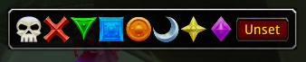
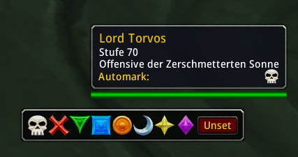

# ThefRaidMarker

A movable bar to set or clear raid target marks. Works with SpikesEasyMarks.

# Why?

It's sometimes more convenient to assign marks to targets via buttons, so you can get rid off keyboard shortcuts.

# What?

ThefRaidMarker shows a movable toolbar with buttons for all eight possible raid markers and an extra button to remove the current mark.

# How?

- [ ] Select a target and click one of the eight buttons to set the raid mark.
- [ ] Click again to remove the mark.
- [ ] Click another button to change the mark.
- [ ] Click and hold the right mouse button on the bar frame to move the bar around.
- [ ] Hold [Alt] and click left to activate or remove automark assignment for the targetted unit. Requires **SpikesEasyMarks**.
- [ ] Show or hide the bar with `/trm toggle`.
- [ ] Open the help dialog of ThefRaidMarker with the slash command `/trm help`
- [ ] Realign the bar to the center of the screen with `/trm reset`.

Also shows the assigned auto mark for SpikesEasyMarks in a units tooltip.

